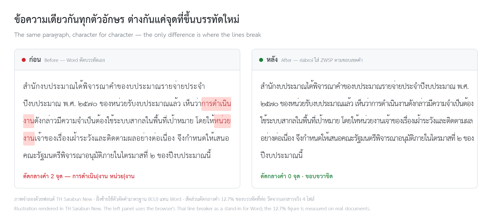

# riabroi-ratchakan-typeset

**เรียบร้อย** — ตัดคำและจัดตัวหนังสือเอกสารราชการไทย ในแบบของกิ๊ฟ
*Riabroi — Thai government document typesetting: words break where they should, and the right edge stays flush.*

<p align="center">
  
</p>

[ภาษาไทย](#ภาษาไทย) · [English](#english)

---

## ภาษาไทย

### คืออะไร

สกิลสำหรับผู้ช่วย AI (Claude, GPT และตัวอื่น ๆ) พร้อมโค้ด Python ที่ใช้งานได้จริง
สำหรับสร้างและจัดหน้าเอกสารราชการไทยในไฟล์ `.docx` ให้เรียบร้อยเหมือนคนจัดเอง

กลั่นจากเอกสารที่ส่งผู้บริหารลงนามไปแล้ว และจากจุดที่เจ้าของงานกดแก้มือเองทีละจุด

### ปัญหาที่แก้

- **Word ตัดบรรทัดไทยกลางคำ** — มันไล่เติมบรรทัดให้เต็มโดยไม่สนขอบเขตคำ
  วัดจากเอกสารจริงเจอ 12.7% ของบรรทัดที่ห่อ เช่น `ระบบสาก|ล` `กำหน|ด` `พื้น|ที่`
- **ขอบขวาไม่ชิด หรือชิดแล้วช่องไฟถ่าง** — แก้ด้วยการบีบระยะอักขระทีละขั้น ไม่ใช่เลิกจัดชิด
- **คำค้างท้ายบรรทัดแล้วอ่านสะดุด** เช่น "ให้" "เมื่อ" "วงเงิน" ค้างอยู่บรรทัดบนเดี่ยว ๆ
- **ฟอนต์ไทยไม่เปลี่ยนตามที่สั่ง** — python-docx ไม่ตั้งฝั่ง complex script ที่อักษรไทยใช้จริง
- **หน้ายืด** — ค่าปริยายของ Word ตั้งระยะบรรทัด 1.15 กับเว้นท้ายย่อหน้า 10 pt มาให้

### ผลที่วัดได้

จากเอกสารประเด็นถามตอบ 4 ไฟล์

| | ก่อน | หลัง |
|---|---|---|
| ตัดกลางคำ | 12.7% ของบรรทัดที่ห่อ | ~0% |
| จำนวนหน้า | 25 | 20 |
| ข้อความ | — | ไม่เปลี่ยนแม้แต่ตัวเดียว |

### ต่างจาก thai-docx

[thai-docx](https://github.com/Netthip/thai-docx-for-a-thai-civil-servant-eager-to-learn) เป็นตัวพื้นฐานสำหรับเอกสารไทยทั่วไป
รีโปนี้ลงรายละเอียดมากกว่า ทั้งการตัดคำและการจัดตัวหนังสือ สำหรับงานราชการโดยเฉพาะ

| เรื่อง | thai-docx | riabroi |
|---|---|---|
| ขอบเขตการตัดคำ | ทีละ run | ทั้งย่อหน้า แล้วแมปกลับเข้า run |
| สระหน้า เ แ โ ใ ไ | ห้ามตัดข้างหน้า | ตัดได้ — ไม่งั้นคำเกาะกันเป็นก้อนยาวจนบรรทัดถ่าง |
| คำประสมยาว | ปล่อยยาว | ซอยตรงจุดที่ได้คำจริงทั้งสองฝั่ง |
| วลีที่ห้ามขาด / คำค้างท้ายบรรทัด | ไม่มี | มี — กฎชุดเต็มของโม 09 (`keep_together`) |
| ชื่อย่อ · ศัพท์ที่พจนานุกรมไม่มี | ตัดกลางได้ | ห้ามตัด (สวรส. · ม.มหิดล · เฝ้าระวัง) |
| ใส่ ZWSP ที่ไหน | ทุกย่อหน้า | เฉพาะเนื้อความที่จัดชิดขอบขวา |
| ขอบขวา | ชิดซ้าย | ชิดขอบ + บีบอักษร 0.1–0.7 pt เลือกขั้นที่ถ่างน้อยสุด |

### ใช้งาน

**ติดตั้ง — Windows**

```bash
git clone https://github.com/Netthip/riabroi-ratchakan-typeset.git
pip install -r riabroi-ratchakan-typeset/requirements.txt
python riabroi-ratchakan-typeset/scripts/doctor.py --pdf
```

**ติดตั้ง — macOS** (อ่าน [ใช้บน Mac](#ใช้บน-mac) ก่อนใช้ครั้งแรก)

```bash
git clone https://github.com/Netthip/riabroi-ratchakan-typeset.git ~/.claude/skills/riabroi-ratchakan-typeset
cd ~/.claude/skills/riabroi-ratchakan-typeset
python3 -m pip install -r requirements.txt
python3 scripts/doctor.py --pdf
```

`doctor.py` ตรวจว่าเครื่องพร้อมไหม — Python ไลบรารี ตัวตัดคำ ฟอนต์ Word แล้วลองส่งออก PDF จริง 1 หน้า

**ใช้เป็นสกิลใน Claude Code** — วางโฟลเดอร์ไว้ที่ `~/.claude/skills/riabroi-ratchakan-typeset`

**ใช้กับผู้ช่วย AI อื่น (เช่น GPT)** — อัปโหลด `SKILL.md` และโฟลเดอร์ `references/` เป็นความรู้ของผู้ช่วย
และอัปโหลด `scripts/` ถ้าผู้ช่วยรันโค้ด Python ได้
สคริปต์ตัดคำต้องมี `pythainlp` — ถ้าผู้ช่วยติดตั้งไม่ได้ (เช่น sandbox ไม่มีอินเทอร์เน็ต)
จะยังได้กฎใน `SKILL.md` อยู่ และสคริปต์จะขึ้นคำเตือนแทนที่จะเงียบ

**เรียกจากโค้ด**

```python
import sys; sys.path.insert(0, "riabroi-ratchakan-typeset/scripts")
from docx import Document
import thai_break, thai_fit

doc = Document("ต้นฉบับ.docx")
thai_fit.normalise_document(doc)       # ฟอนต์ฝั่งไทยครบ + เคลียร์ค่าที่ทำให้หน้ายืด
thai_fit.justify_body(doc)             # เนื้อความชิดขอบขวา (หัวเรื่อง/ลายเซ็นไม่โดน)
thai_break.insert_zwsp_document(doc)   # บอก Word ว่าตัดบรรทัดตรงไหนได้ (เฉพาะเนื้อความ)
doc.save("ผลลัพธ์.docx")
```

**ตรวจผล** (ต้องมี Microsoft Word บน Windows หรือ Mac เพื่อส่งออก PDF — ไม่มี Word ใช้ LibreOffice ได้
แต่ LibreOffice ตัดบรรทัดไม่เหมือน Word จึงใช้ดูภาพรวมเท่านั้น)

```bash
python scripts/inspect_docx.py ผลลัพธ์.docx --png ภาพ --breaks   # --breaks = รอยต่อบรรทัดทุกจุดไว้อ่านเอง
python tests/test_thai_break.py
python tests/test_platform.py
```

รายงานบอกด้วยว่า PDF มาจากโปรแกรมไหน และ **ฟอนต์ถูกแทนไหม** — ถ้าเครื่องไม่มี TH SarabunPSK
Word จะใช้ฟอนต์อื่นแทนเงียบ ๆ แล้วผลวัดทั้งหมดใช้ไม่ได้

### ใช้บน Mac

ส่งออก PDF ด้วย Word for Mac แทน Word บน Windows — ส่วนตัดคำและจัดหน้าเหมือนเดิมทุกอย่าง

**ก่อนใช้ครั้งแรก**

1. **ติดตั้งฟอนต์ TH SarabunPSK** — Mac ไม่มีมาให้ ดับเบิลคลิกไฟล์ `.ttf` แล้วกด Install Font
2. **ตั้ง Word ให้ส่งออก PDF แบบ Best for printing** — ใน Word เลือก File › Save As… › File Format: PDF
   แล้วเลือก *Best for printing* บันทึกหนึ่งครั้ง สคริปต์จะใช้ตัวเลือกล่าสุดที่เลือกด้วยมือ
   ถ้าค้างอยู่ที่ *Best for electronic distribution* Word จะส่งไฟล์ไปแปลงบนบริการออนไลน์ของ Microsoft
3. **รัน `python3 scripts/doctor.py --pdf` ตอนนั่งอยู่หน้าเครื่อง** — จะมีกล่องขออนุญาต 2 กล่อง กดครั้งเดียวจบ
   - macOS ถามว่าให้แอปที่รันคำสั่ง (Terminal หรือ Claude) ควบคุม Microsoft Word ได้ไหม → OK
   - Word ถามสิทธิ์โฟลเดอร์ `~/riabroi-pdf` (Grant File Access) → Select… แล้ว Grant Access

**ต่างจาก Windows ตรงไหน**

- Mac เปิด Word ได้ตัวเดียว สคริปต์จึงเปิด **สำเนาชื่อสุ่ม** ใน `~/riabroi-pdf` ปิดเฉพาะไฟล์นั้น
  และไม่ปิด Word ที่ใช้อยู่ — เอกสารที่เปิดค้างไว้ไม่ถูกแตะ
- ใช้ `python3` แทน `python` · ถ้า pip ขึ้น `externally-managed-environment` (Python จาก Homebrew)
  ให้ติดตั้งใน venv: `python3 -m venv ~/.venvs/riabroi` แล้วเรียกสคริปต์ด้วย `~/.venvs/riabroi/bin/python`
- **Word for Mac อาจตัดบรรทัดไม่ตรงกับ Windows** — เอกสารที่จะพิมพ์หรือส่งต่อจากเครื่อง Windows
  ให้ตรวจรอบสุดท้ายบน Windows
- ไฟล์ TH SarabunIT๙ รุ่น Windows ตั้งชื่อตระกูลแบบใหม่ (name ID 16) ไว้ว่า TH SarabunPSK และ IT๙ วาดเลขอารบิก
  เป็นรูปเลขไทย ถ้าติดตั้งคู่กับ PSK บน Mac อาจรวมเป็นตระกูลเดียวกัน — `doctor.py` จะเตือน

ทางเดิน Mac ผ่านเทสต์แบบจำลองแล้ว แต่ยังไม่ได้ลองกับ Word for Mac จริง
ถ้าเจอปัญหา เปิด issue พร้อมผล `python3 scripts/doctor.py --pdf`

### โครงรีโป

```
SKILL.md                กฎและลำดับงาน (ผู้ช่วย AI อ่านไฟล์นี้)
references/
  typesetting.md        จัดหน้า บีบอักษร คำค้าง วิธีวัดผล
  forms.md              ขอบกระดาษและผังของเอกสารแต่ละแบบ
  toolchain.md          Word บน Windows/Mac · อ่าน PDF · กับดักที่เจอมาแล้ว
scripts/
  thai_break.py         ตัดคำ + ใส่ ZWSP
  thai_fit.py           ฟอนต์ · บีบอักษร · line break · ระยะบรรทัด
  inspect_docx.py       ส่งออก PDF แล้ววัดผลจริง · ตรวจฟอนต์ถูกแทน
  word_pdf_mac.applescript  สั่ง Word for Mac ส่งออก PDF
  doctor.py             ตรวจเครื่องก่อนใช้ (Windows / macOS)
tests/                  เทสต์จากจุดที่เคยพังจริง + ส่วนที่ขึ้นกับเครื่อง (จำลอง)
evals/                  ทดสอบว่าผู้ช่วย AI หยิบสกิลนี้ถูกจังหวะ (14/14)
CHANGELOG.md            บันทึกการเปลี่ยนแปลงแต่ละเวอร์ชัน
```

### สัญญาอนุญาต

[MIT](LICENSE) — เอาไปใช้ แก้ต่อ และแจกจ่ายได้ทั้งงานราชการและงานส่วนตัว ขอแค่ติดประกาศลิขสิทธิ์ไปด้วย

---

## English

### What it is

A skill for AI assistants (Claude, GPT and others) plus working Python code
for producing and typesetting Thai government documents in `.docx` — so they look hand-set.

Distilled from documents already sent up for signature, and from the exact spots
the author fixed by hand, one line break at a time.

### Problems it solves

- **Word breaks Thai lines mid-word.** It fills each line to the edge regardless of word boundaries.
  Measured on real documents: 12.7% of wrapped lines broke inside a word.
- **Ragged right edge, or a flush edge with stretched spacing.** Fixed by condensing
  character spacing step by step — not by giving up on justification.
- **Dangling words at line ends** that make a sentence stumble.
- **Thai fonts that don't change.** python-docx never sets the complex-script font slot Thai actually uses.
- **Bloated pages.** Word's defaults add 1.15 line spacing and 10 pt after every paragraph.

### Measured results

On 4 committee Q&A documents:

| | Before | After |
|---|---|---|
| Mid-word breaks | 12.7% of wrapped lines | ~0% |
| Pages | 25 | 20 |
| Text | — | unchanged, character for character |

### How it differs from thai-docx

[thai-docx](https://github.com/Netthip/thai-docx-for-a-thai-civil-servant-eager-to-learn) is the general-purpose base for Thai documents.
This repo goes further on both word breaking and typesetting, specifically for government work.

| | thai-docx | riabroi |
|---|---|---|
| Segmentation scope | per run | whole paragraph, mapped back into runs |
| Leading vowels เ แ โ ใ ไ | never break before | breakable — otherwise words clump into 25–30 character blocks |
| Long compounds | left whole | split only where both halves are real dictionary words |
| Protected phrases / dangling lead words | — | yes — the full `keep_together` rule set |
| Abbreviations · words missing from the dictionary | may split | never split (สวรส. · ม.มหิดล · เฝ้าระวัง) |
| Where ZWSP goes | every paragraph | justified body text only |
| Right edge | left-aligned | justified, condensed 0.1–0.7 pt, least-stretched step wins |

### Usage

**Install — Windows**

```bash
git clone https://github.com/Netthip/riabroi-ratchakan-typeset.git
pip install -r riabroi-ratchakan-typeset/requirements.txt
python riabroi-ratchakan-typeset/scripts/doctor.py --pdf
```

**Install — macOS** (read [On a Mac](#on-a-mac) before the first run)

```bash
git clone https://github.com/Netthip/riabroi-ratchakan-typeset.git ~/.claude/skills/riabroi-ratchakan-typeset
cd ~/.claude/skills/riabroi-ratchakan-typeset
python3 -m pip install -r requirements.txt
python3 scripts/doctor.py --pdf
```

`doctor.py` checks the machine — Python libraries, the segmenter, fonts, Word — then exports one real test page to PDF.

**As a Claude Code skill** — place the folder at `~/.claude/skills/riabroi-ratchakan-typeset`

**With other AI assistants (e.g. GPT)** — upload `SKILL.md` and `references/` as knowledge,
plus `scripts/` if the assistant can run Python.
The segmentation script needs `pythainlp`. If the assistant can't install it (e.g. an offline sandbox),
you still get the rules in `SKILL.md`, and the script warns instead of silently doing nothing.

**From code**

```python
import sys; sys.path.insert(0, "riabroi-ratchakan-typeset/scripts")
from docx import Document
import thai_break, thai_fit

doc = Document("input.docx")
thai_fit.normalise_document(doc)       # complex-script fonts + clear page-bloating defaults
thai_fit.justify_body(doc)             # justify body text (titles/signatures untouched)
thai_break.insert_zwsp_document(doc)   # tell Word where Thai lines may break (body text only)
doc.save("output.docx")
```

**Verify** (needs Microsoft Word on Windows or Mac to export PDF — LibreOffice works without Word,
but it breaks Thai lines differently, so treat its output as a rough preview only)

```bash
python scripts/inspect_docx.py output.docx --png images --breaks   # --breaks = every line break, to read yourself
python tests/test_thai_break.py
python tests/test_platform.py
```

The report also says which program made the PDF and **whether the font was substituted** — without
TH SarabunPSK installed, Word silently falls back to another font and every measurement becomes meaningless.

### On a Mac

PDF export goes through Word for Mac instead of Word on Windows. Segmentation and typesetting are unchanged.

**Before the first run**

1. **Install TH SarabunPSK.** macOS doesn't ship it. Double-click the `.ttf` file and choose Install Font.
2. **Set Word's PDF export to Best for printing.** In Word, choose File › Save As… › File Format: PDF,
   select *Best for printing* and save once. Scripted exports reuse the last manual choice;
   *Best for electronic distribution* sends the document to a Microsoft online service for conversion.
3. **Run `python3 scripts/doctor.py --pdf` while at the machine.** Two permission prompts appear once:
   - macOS asks whether the app running the command (Terminal or Claude) may control Microsoft Word → OK
   - Word asks for access to `~/riabroi-pdf` (Grant File Access) → Select… then Grant Access

**What differs from Windows**

- Word for Mac is a single instance, so the script opens a **randomly named copy** in `~/riabroi-pdf`,
  closes only that copy, and never quits a Word you are using. Documents you have open are not touched.
- Use `python3` instead of `python`. If pip reports `externally-managed-environment` (Homebrew Python),
  install into a venv: `python3 -m venv ~/.venvs/riabroi`, then run scripts with `~/.venvs/riabroi/bin/python`.
- **Word for Mac may break lines differently from Windows.** If the document will be printed or passed on
  from a Windows machine, do the final check on Windows.
- The Windows build of TH SarabunIT๙ declares its typographic family (name ID 16) as TH SarabunPSK, and it draws
  Arabic digits as Thai numerals. Installed next to PSK on a Mac, the two may merge into one family — `doctor.py` warns.

The Mac path passes simulated tests but has not yet been run against a real Word for Mac.
If something fails, open an issue with the output of `python3 scripts/doctor.py --pdf`.

### Key findings

- Setting `w:lang w:bidi="th-TH"` does **not** fix line breaking — tested in isolation, identical results.
  Only zero-width spaces (U+200B) at word boundaries work.
- Line spacing below 1.0 makes Thai tone marks collide with the line above (0.95 → 4 collisions).
- Child elements of `w:rPr` must follow schema order, or Word silently drops the property.
- More condensing is not always better: pulling words up can leave the next line shorter and wider.
  Measure every step and keep the least-stretched one.
- Put ZWSP in justified body text only. Inserting it into every paragraph made documents
  impossible to review (the author's words: "can't tell right from wrong").
- Automated checks use the same dictionary as the segmenter, so they miss words the dictionary lacks.
  Every real error in the Q&A example (`สว / รส.`, `เฝ้า / ระวัง`) was found by reading each line break.

### Repository layout

```
SKILL.md                rules and workflow (the AI assistant reads this)
references/
  typesetting.md        condensing, dangling words, measurement
  forms.md              margins and layouts per document type
  toolchain.md          Word on Windows/Mac, reading PDFs, known pitfalls
scripts/
  thai_break.py         segmentation + ZWSP insertion
  thai_fit.py           fonts, condensing, line breaks, line spacing
  inspect_docx.py       export PDF, measure the real result, detect font substitution
  word_pdf_mac.applescript  drives Word for Mac to export PDF
  doctor.py             machine check before first use (Windows / macOS)
tests/                  regression tests from real failures + simulated platform tests
evals/                  checks that assistants pick this skill at the right time (14/14)
CHANGELOG.md            what changed in each version
```

### License

[MIT](LICENSE) — use it, change it, ship it, in government work or your own. Just keep the copyright notice.
